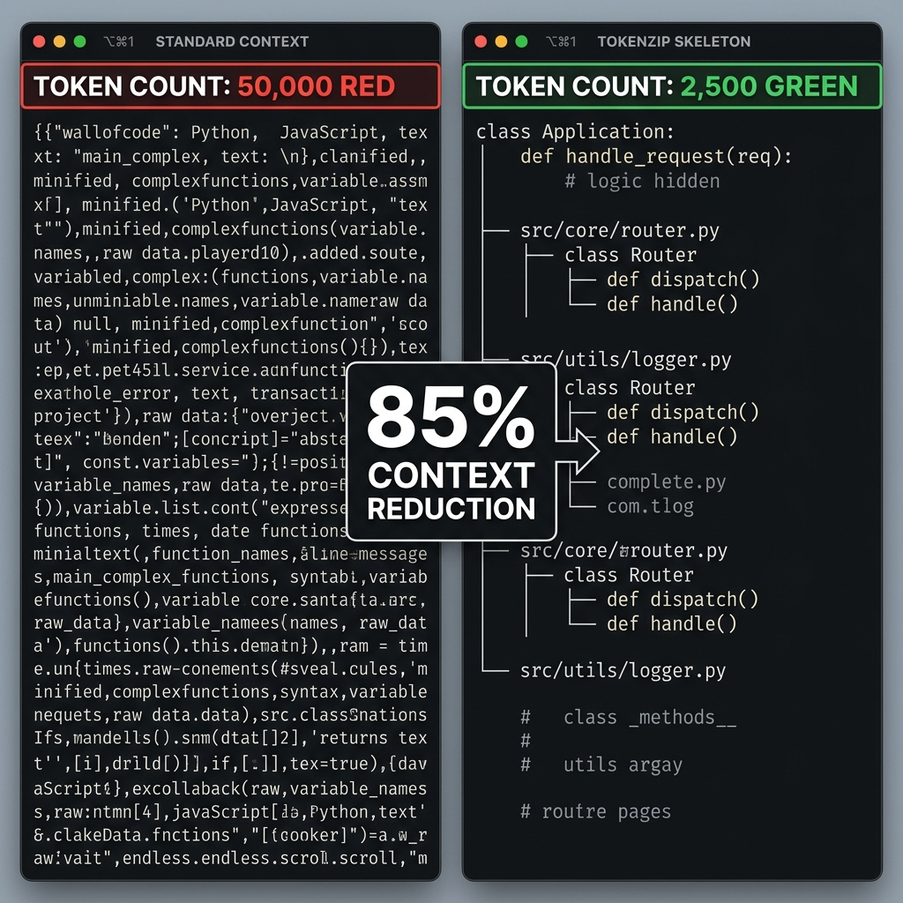
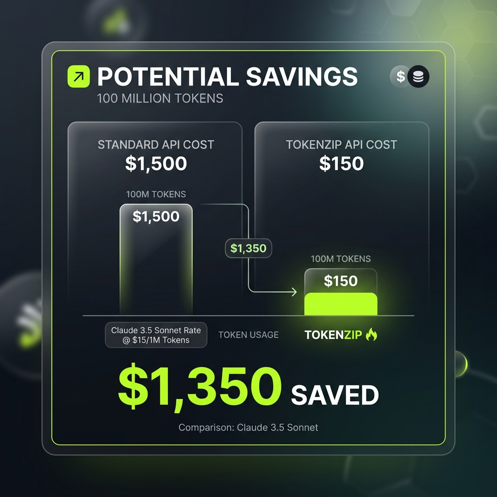
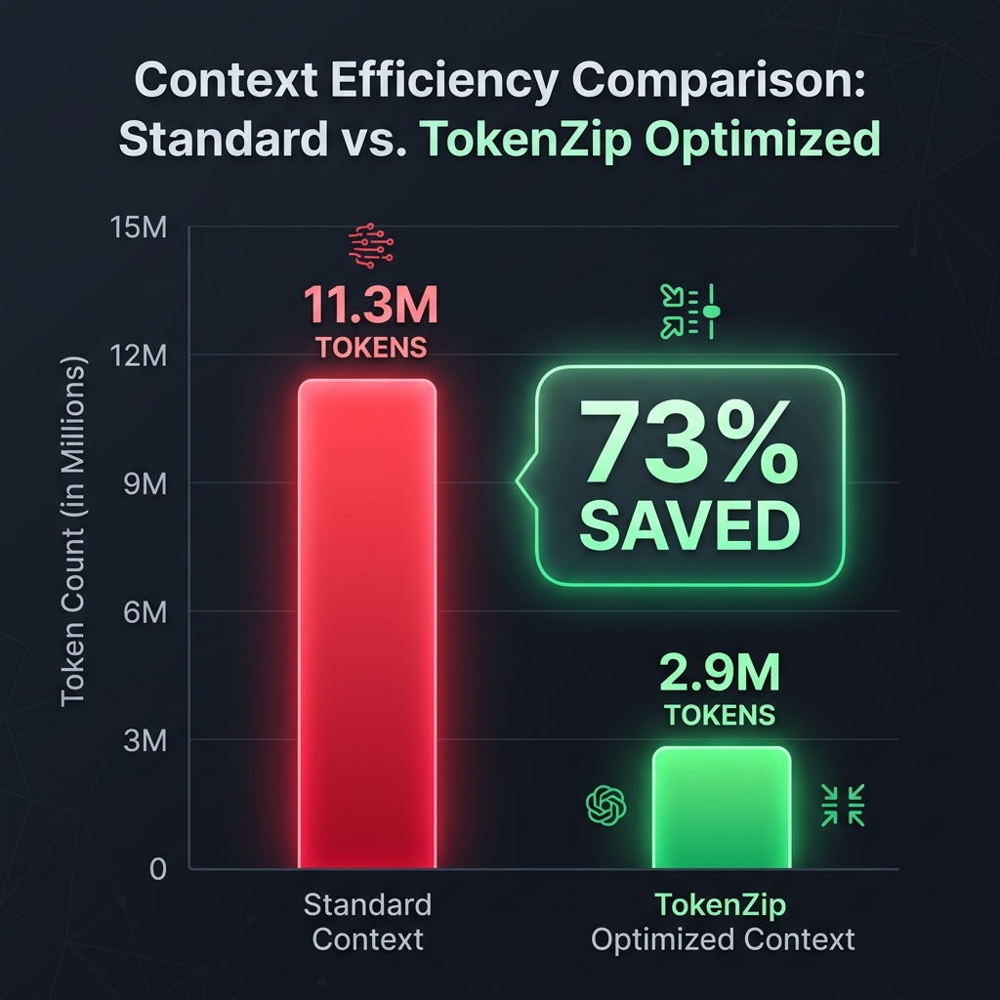

<div align="center">

# 🗜️ TokenZip

**The Semantic Compression Layer for AI Agents.**  
Transform any codebase into a queryable knowledge graph and stop wasting tokens on implementation details.



[](https://www.npmjs.com/package/tokenzip)
[](https://nodejs.org)
[](LICENSE)
[](https://github.com/devilankur18/tokenzip/actions)

</div>

---

## 🔍 What is TokenZip? (AI-Native Code Intelligence)

TokenZip is a **Graph-Based Code Intelligence Engine** designed to solve the "Context Bloat" problem in AI-assisted development. By indexing your codebase into a relational knowledge graph, it allows agents like **Claude Desktop**, **Cursor**, and **Copilot** to navigate complex repositories with 90% fewer tokens.


AI agents (Claude, Cursor, Copilot) are context-starved. Feeding them entire source files is like giving someone a whole book when they only need the table of contents and a few specific chapters.

**TokenZip** transforms your codebase into a **Relational Knowledge Graph**. It indexes symbols, relationships, and call stacks, allowing AI agents to "see" your code's structure and APIs without drowning in redundant implementation logic.

---

## 🚀 The Gain: `file_read` vs `smart_file_read`

Most AI tools rely on a standard `file_read` tool that dumps the raw text of a file into the context window. **TokenZip replaces this with `smart_file_read`**, leveraging **Skeletonization** to prune code context intelligently.

| Tool | Approach | Context Footprint | Cost/Latency |
| :--- | :--- | :--- | :--- |
| `file_read` | Raw Text | 100% (Full file) | 🔴 High / Overflows |
| **`smart_file_read`** | **Semantic Skeleton** | **10% - 30%** | **🟢 Low / Efficient** |

### What is Skeletonization?
Instead of reading the whole file, TokenZip generates a **Skeleton Projection**:
- **Keeps**: Imports, Exports, Class definitions, Function signatures, and Type declarations.
- **Hides**: Function/Method bodies (`/* ... implementation hidden ... */`).
- **Benefit**: The AI understands exactly **how to use** your code without wasting tokens on **how it works** internally.

#### 💡 Scenario: Building a Feature across 5 Files
Imagine you are fixing a bug or adding a feature that touches **5 source files** (~1,400 tokens each).

| Metric | Standard `file_read` | TokenZip `smart_file_read` |
| :--- | :--- | :--- |
| **Initial Context (Turn 1)** | ~15,000 tokens | **~3,000 tokens** |
| **Turn 5 (Context Bloat)** | 🔴 **~100,000 tokens** | 🟢 **~15,000 tokens** |
| **Total 10-Iteration Cost** | 🔴 **~1,100,000 tokens** | 🟢 **~165,000 tokens** |
| **Token Savings** | 0% (Baseline) | **85% SAVED 🚀** |

**The "Token Tax" Trap**: 
Standard agents send the *entire* content of every file they read in every turn. This "Context Bloat" causes a simple session to explode from 15K to 100K+ tokens in just a few turns, quickly hitting model limits and making the agent "hallucinate" as it loses its train of thought.

**The TokenZip Edge**: 
By reading **Skeletons** during navigation and only fetching full implementations when absolutely necessary, TokenZip reduces the "cumulative tax" by **~85%**. This allows you to perform deep, multi-file refactors for the price of a single standard chat.



---

## 📊 Case Study: OpenClaw (14K+ Files)

[OpenClaw](https://github.com/Clawdi-AI/openclaw) is a massive project heavy-coded with AI. In a benchmark comparing raw context vs. TokenZip optimization, the results were staggering:

| Metric | Standard `file_read` | TokenZip `smart_file_read` |
| :--- | :--- | :--- |
| **Total Context Footprint** | 11.3 Million Tokens | 2.9 Million Tokens |
| **Token Savings** | 0% | **73% 🚀** |
| **Input Cost (Per Turn)** | 🔴 11.3M Tokens | 🟢 2.9M Tokens |
| **5-Turn Cumulative** | 🔴 56.5M Tokens | 🟢 14.5M Tokens |
| **Direct Savings (5 Turns)** | **--** | **42M Tokens (~$210+ for claude opus Saved)** |



*By reducing the "per-file" token tax, TokenZip allows your AI agents to maintain massive repositories in their active memory without hitting token limits or burning through API budgets.*

*Check out the [detailed benchmark report](https://gist.github.com/devilankur18/e21baec76d348dd2f1cd3339c3a1d319) for file-level metrics.*

---

## 🛠️ Key Features

- **Relational Graph Database**: Powered by **SurrealDB**, storing files → modules → symbols → call edges.
- **Deep Code Analysis**: Uses **Tree-sitter** to extract complex relationships (`calls`, `imports`, `inherits`, `implements`).
- **AI-Ready (MCP)**: Exposes the graph as an **MCP server** for deep context in Claude Desktop, Cursor, and more.
- **Incremental Parsing**: Only indexes changed files using content hashing—perfect for large repos.
- **Git Enrichment**: Maps symbol history to git commits for better context.
- **Deep Structural Awareness**: Recursive `query_repo_structure` allows agents to traverse Modules -> Files -> Symbols in one shot.
- **High Concurrency & Stability**: Built-in stale process detection and lock recovery for reliable multi-agent access.

---

## 🚀 Vision: Agentic Infrastructure for the Modern Stack

**TokenZip** is not just a compression utility; it is the **Cognitive Infrastructure** that transforms AI from a reactive "agent" into an autonomous **AI Engineer**. By building a persistent, multi-level Knowledge Graph of your codebase, we provide agents with the "Long-Term Memory" they need to act with precision.

### 🧠 Why This Matters
Vectorised Search and "context-stuffing" are like giving an engineer a stack of Polaroid photos and asking them to build a skyscraper. **TokenZip** gives them the blueprints.

### 🛠 Real-World Value & Use Cases

#### 1. Surgical Context: "Query vs. Read"
*   **The Problem:** Burning 50k tokens just to explain a project structure to a model.
*   **The Solution:** TokenZip replaces "context dumps" with **500-token Structured Queries**. Agents don't "read" files to find dependencies; they query the graph.
*   **Real Use Case:** An agent can instantly locate every implementation of a specific interface across a monorepo without scanning a single unrelated line of code.

#### 2. Autonomous Multi-Hop Reasoning
*   **The Problem:** "Refactor this function" often leads to broken builds because the AI missed a call site in another module.
*   **The Solution:** Enables **Recursive Impact Analysis**. The agent traces the "social graph" of your code to see exactly who calls what, where, and how.
*   **Real Use Case:** Safely refactor a core API endpoint. TokenZip alerts the agent to 12 different call sites across 3 services, allowing for a verified, end-to-end update.

#### 3. Semantic Grounding (The "Ground Truth")
*   **The Problem:** LLMs "hallucinate" library versions or function signatures when they aren't in the immediate window.
*   **The Solution:** Moves the AI from *Creative Token Prediction* to **Structural Assembly**. The agent verifies every symbol, import, and type against the Memory Mesh before writing code.
*   **Real Use Case:** Ensuring new code perfectly matches the specific middleware and error-handling patterns used in the rest of your proprietary codebase.

#### 4. Federated Memory (Institutional Lore)
*   **The Problem:** "Tribal knowledge" is lost when developers leave or when working across siloed repositories.
*   **The Solution:** A persistent **Repository of Record**. The graph stores the *reasoning* and *relationships* of the code, not just the text.
*   **Real Use Case:** A Frontend agent "consults" the memory of the Backend repo to understand a schema change—eliminating the need for manual cross-team coordination.

> **The Bottom Line:** TokenZip moves your AI strategy from "guessing based on text" to "navigating based on logic." It is the foundation for agents that don't just write code, but understand the system they are building.

---

## 🏗️ Technical Architecture & Memory Mesh

TokenZip builds a **Federated Memory** of your code. Instead of raw text, it stores symbols, relationships, and call edges in a high-performance **SurrealDB** graph.


For a deep dive into how the "Memory Mesh" works, see our [Architecture Guide](docs/architecture.md).

---

## ⚡ Quick Start (Zero to Running in 30s)

[](https://colab.research.google.com/github/devilankur18/tokenzip/blob/main/notebooks/tokenzip_demo.ipynb)

### 1. Install
```bash
npm install -g tokenzip
```

### 2. Initialize & Parse
```bash
# Go to your repository
cd /path/to/repo

# Initialize metadata (.tokenzip/)
tokenzip init

# Build the knowledge graph
tokenzip parse
```

### 3. Expose to AI
Start the MCP server to let your AI agents use `smart_file_read`, `query_symbol`, and `find_references`.
```bash
tokenzip serve
```

---

## 📖 CLI Usage

### `tokenzip search <query>`
Find any symbol, its signature, and its relationships across the codebase.
```bash
tokenzip search createMcpServer
```

### `tokenzip smart-read <file_path>`
Test the compression logic directly from your terminal.
```bash
# Get the skeleton (no function bodies)
tokenzip smart-read src/engine/indexer.ts --mode skeleton

# Get only signatures and types
tokenzip smart-read src/engine/indexer.ts --mode interface_only
```

### `tokenzip report`
Generate a token efficiency audit for your own repository.
```bash
tokenzip report --output audit.md
```

---

## 🤖 MCP Server (Agentic Context)

TokenZip is a first-class MCP server. It gives AI agents (like Claude Desktop) deep repository awareness.

### 1. Start the server
```bash
tokenzip serve
```

### 2. Connect to Claude
Add this to your `claude_desktop_config.json`:
```json
{
  "mcpServers": {
    "tokenzip": {
      "command": "tokenzip",
      "args": ["serve", "--cwd", "/path/to/your/repo"]
    }
  }
}
```

> [!TIP]
> If you are running TokenZip from source, run `npm link` in the root of this project to make the `tokenzip` command available globally.

### 🌳 Deep Structural Awareness
The `query_repo_structure` tool now supports recursive depth, allowing agents to understand your repository's layout from modules down to individual symbols in a single query.
- **Recursive Hierarchy**: Explore Repo → Folders → Files → Symbols with configurable depth.
- **Balanced Truncation**: High-density structures are pruned intelligently (targeting the largest lists first) to fit within AI context windows while preserving the overall "map."

For more details, see the [MCP Guide](docs/mcp_guide.md).

## 🛠️ Commands
## ⚙️ Configuration

Set the `TOKENZIP_CWD` environment variable in your `.zshrc` or `.bashrc` to run commands from anywhere:
```bash
---

## 🏠 Local LLM Support (Ollama / LocalAI)

TokenZip is the perfect companion for **Local LLMs** where context windows are often constrained. By skeletonizing files, you can fit massive context into models like `Qwen-Coder` or `CodeLlama` running on your own hardware.

Check out the [Local LLM Guide](docs/local_llm_guide.md) for optimized settings.

---


## 🏗️ Project Status & Roadmap

> [!IMPORTANT]
> TokenZip v2 is currently **Experimental**. We are actively refining the edge resolution logic and adding more language support.

- [x] TypeScript / JavaScript support
- [ ] Python Extractor
- [ ] Go / Rust Support
- [ ] Visual Graph Explorer (Web UI)
- [ ] Deeper Call Graph Resolution

---

---

## 🤝 Contributing & Community

We welcome contributions of all sizes! 
- **Add a Language**: We need extractors for Python, Go, and Rust.
- **Improve Tools**: Help us refine the MCP tools for better agentic reasoning.

Please see [CONTRIBUTING.md](CONTRIBUTING.md) to get started.

## 📜 License

MIT © [Ankur Agarwal](https://github.com/devilankur18)
