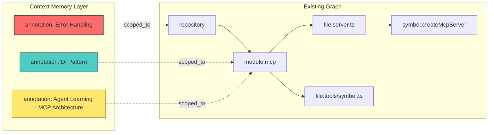
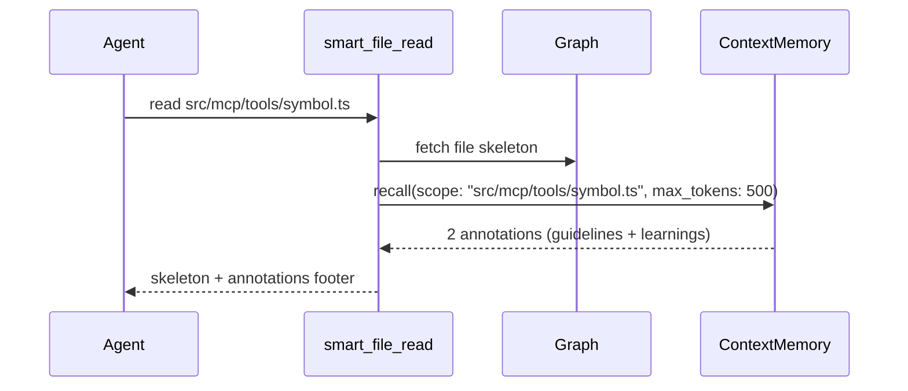

# Context Memory — Design Document

## Feature Name: **Context Memory**

**Rationale**: "Notes" is too generic and passive. **Context Memory** conveys what this actually is — *persistent, structured, graph-linked memory* that coding agents can write to and read from across sessions. It's the bridge between ephemeral conversation context and permanent codebase knowledge.

Alternative candidates considered:
| Name | Why rejected |
|---|---|
| Notes | Too passive, implies human-only authorship |
| Knowledge Base | Overlaps with existing graph terminology |
| Agent Memory | Too agent-centric, developers also contribute |
| Codebase Journal | Implies chronological, not structural |
| **Context Memory** ✅ | Structural, bidirectional (human ↔ agent), graph-native |

---

## Problem Statements

### Problem 1: Repetitive Developer Instructions
Every new session, developers re-explain:
- "Always use dependency injection in this module"
- "This file follows the repository pattern"  
- "Error handling must use our custom `AppError` class"
- "Tests in this directory use factory fixtures, not mocks"

This context is **lost** when the session ends. The developer repeats it, the agent re-consumes tokens to process it, and both waste time.

### Problem 2: Repetitive Agent Learning
Every new session, agents re-traverse:
- Reading 50+ files to understand architecture
- Discovering the same patterns and conventions
- Re-learning which modules are entry points
- Re-discovering non-obvious relationships

This burns **thousands of tokens** on information the agent already learned in a prior session.

### Problem 3: No Feedback Loop
Agents can't communicate *back* to tool developers about what's inefficient. There's no structured way to say "I had to read 47 files to understand the testing pattern — a single tool call could have answered this."

---

## Architecture

### Core Insight: Annotations Are Graph Nodes

Instead of a separate key-value store, annotations live **in the existing knowledge graph** as first-class nodes, connected to files, modules, symbols, and the repository via typed edges. This means:

1. **Queries are graph traversals** — "give me all coding guidelines for files in `src/mcp/`" is a single graph walk
2. **Inheritance works naturally** — a guideline on a module propagates to its files and symbols
3. **No duplication** — one annotation can be linked to many targets
4. **Context-aware retrieval** — when the agent reads a file, relevant annotations surface automatically



---

## Data Model

### Annotation Node

```sql
DEFINE TABLE OVERWRITE annotation SCHEMAFULL;
DEFINE FIELD OVERWRITE type      ON annotation TYPE string DEFAULT 'annotation';
DEFINE FIELD OVERWRITE category  ON annotation TYPE string
  ASSERT $value IN [
    'coding_guideline',     -- "Always use async/await, never .then()"
    'design_pattern',       -- "This module uses Repository pattern"
    'arch_decision',        -- "We chose SurrealDB over Neo4j because..."
    'testing_strategy',     -- "Use factory fixtures, not mocks"
    'naming_convention',    -- "Prefix all MCP tools with create*Tools"
    'error_handling',       -- "All errors must extend AppError"
    'performance_hint',     -- "This query is O(n²), batch when >100 items"
    'security_concern',     -- "Never log PII from this module"
    'agent_learning',       -- Agent-written: "This module handles X by doing Y"
    'agent_suggestion',     -- Agent-written: improvement suggestions
    'workflow_note',        -- "Deploy sequence: build → migrate → restart"
    'todo',                 -- Persistent TODOs that survive sessions
    'custom'                -- Escape hatch for anything else
  ];
DEFINE FIELD OVERWRITE title     ON annotation TYPE string;
DEFINE FIELD OVERWRITE content   ON annotation TYPE string;
DEFINE FIELD OVERWRITE author    ON annotation TYPE string DEFAULT 'human';
  -- 'human' | 'agent' | agent identifier
DEFINE FIELD OVERWRITE confidence ON annotation TYPE option<float> DEFAULT 1.0;
  -- 0.0-1.0, agents can indicate certainty
DEFINE FIELD OVERWRITE tags      ON annotation TYPE array DEFAULT [];
  -- freeform tags for cross-cutting concerns: ["error-handling", "v2-migration"]  
DEFINE FIELD OVERWRITE priority  ON annotation TYPE option<string>
  ASSERT $value IN [NONE, 'critical', 'important', 'normal', 'low'];
DEFINE FIELD OVERWRITE supersedes ON annotation TYPE option<record<annotation>>;
  -- points to the annotation this one replaces (versioning)
DEFINE FIELD OVERWRITE is_active ON annotation TYPE bool DEFAULT true;
  -- soft delete / archival
DEFINE FIELD OVERWRITE created_at ON annotation TYPE datetime DEFAULT time::now();
DEFINE FIELD OVERWRITE updated_at ON annotation TYPE datetime DEFAULT time::now();
DEFINE FIELD OVERWRITE session_id ON annotation TYPE option<string>;
  -- tracks which session created this
```

### Edge: `scoped_to` (Annotation → Target)

```sql
DEFINE TABLE OVERWRITE scoped_to SCHEMALESS 
  TYPE RELATION IN annotation OUT repository | module | file | symbol;
DEFINE FIELD OVERWRITE scope_type ON scoped_to TYPE string
  ASSERT $value IN ['codebase', 'module', 'file', 'symbol'];
```

### Edge: `tagged_with` (Any Node → Annotation)

Optional reverse convenience edge for discovery:
```sql  
DEFINE TABLE OVERWRITE tagged_with SCHEMALESS
  TYPE RELATION IN repository | module | file | symbol OUT annotation;
```

### Indexes

```sql
DEFINE INDEX OVERWRITE idx_annotation_category ON annotation FIELDS category;
DEFINE INDEX OVERWRITE idx_annotation_tags ON annotation FIELDS tags;
DEFINE INDEX OVERWRITE idx_annotation_active ON annotation FIELDS is_active;
DEFINE INDEX OVERWRITE idx_annotation_author ON annotation FIELDS author;
DEFINE INDEX OVERWRITE idx_annotation_title ON annotation FIELDS title;
```

---

## Scope Hierarchy & Inheritance

Annotations inherit **downward** through the graph:

```
codebase (repository)
  └── module
       └── file
            └── symbol
```

When recalling annotations for `src/mcp/tools/symbol.ts`:
1. Direct annotations on the file
2. Annotations on its parent module (`src/mcp`)
3. Annotations on the repository (codebase-wide)

This means a developer writes **once** — "all MCP tools must validate inputs" scoped to `module:mcp` — and every file/symbol in that module inherits it.

---

## MCP Tool Interfaces

### Tool 1: `annotate`

**Purpose**: Save structured knowledge to the graph. Used by both developers (via agent proxy) and agents directly.

```json
{
  "name": "annotate",
  "description": "Save a structured annotation (guideline, learning, pattern, etc.) to the knowledge graph. Annotations are scoped to a target (codebase, module, file, or symbol) and persist across sessions. Use this to record coding guidelines, architectural decisions, learned patterns, or improvement suggestions.",
  "inputSchema": {
    "type": "object",
    "properties": {
      "category": {
        "type": "string",
        "enum": ["coding_guideline", "design_pattern", "arch_decision", "testing_strategy", "naming_convention", "error_handling", "performance_hint", "security_concern", "agent_learning", "agent_suggestion", "workflow_note", "todo", "custom"],
        "description": "The type of annotation. Use 'agent_learning' for insights you've discovered about the codebase. Use 'agent_suggestion' for improvement ideas."
      },
      "title": {
        "type": "string",
        "description": "A concise, searchable title (e.g., 'Error Handling Pattern', 'Module Architecture Overview')."
      },
      "content": {
        "type": "string",
        "description": "The annotation body. Keep it structured and concise — this will be injected into future contexts."
      },
      "scope": {
        "type": "string", 
        "description": "Target scope: 'codebase' for repo-wide, or a path like 'src/mcp' (module), 'src/mcp/server.ts' (file), or symbol name."
      },
      "tags": {
        "type": "array",
        "items": { "type": "string" },
        "description": "Optional cross-cutting tags for filtering (e.g., ['error-handling', 'v2'])."
      },
      "priority": {
        "type": "string",
        "enum": ["critical", "important", "normal", "low"],
        "description": "How important this annotation is. 'critical' annotations are always surfaced."
      },
      "supersedes": {
        "type": "string",
        "description": "Optional annotation ID this replaces (for updating existing knowledge)."
      }
    },
    "required": ["category", "title", "content", "scope"]
  }
}
```

**Example calls**:

```jsonc
// Developer instruction (via agent proxy)
{
  "category": "coding_guideline",
  "title": "Dependency Injection in MCP Tools",
  "content": "All MCP tool factory functions must accept (store: IStore, repoPath: string, budget: TokenBudgetManager) as parameters. Never import store directly.",
  "scope": "src/mcp/tools",
  "priority": "important",
  "tags": ["dependency-injection", "mcp"]
}

// Agent learning
{
  "category": "agent_learning", 
  "title": "MCP Server Architecture",
  "content": "The MCP server uses a registry pattern: each tool module exports a create*Tools() factory that returns tool definitions. Tools are registered in registry.ts and wrapped with usage tracking middleware. The server uses StdioServerTransport for communication.",
  "scope": "src/mcp",
  "tags": ["architecture", "entry-point"]
}

// Agent suggestion
{
  "category": "agent_suggestion",
  "title": "Batch Symbol Resolution Tool",
  "content": "Problem: To understand a file's API, I need to call query_symbol for each export individually (N calls, ~200 tokens each). Suggestion: A batch_query_symbols tool that accepts an array of names and returns all definitions in one call. Expected savings: ~80% fewer tokens for multi-export files.",
  "scope": "codebase",
  "tags": ["tool-improvement", "token-savings"]
}
```

### Tool 2: `recall`

**Purpose**: Retrieve relevant annotations for a given context. Smart filtering by scope, category, and tags. **Budget-aware** — returns only what fits the context window.

```json
{
  "name": "recall",
  "description": "Retrieve relevant annotations (guidelines, learnings, patterns) for a specific context. Annotations are resolved using scope inheritance: a file inherits its module's and codebase's annotations. Use this at the start of a task to load relevant context, or when working on a specific file/module.",
  "inputSchema": {
    "type": "object",
    "properties": {
      "scope": {
        "type": "string",
        "description": "The target to recall annotations for. 'codebase' for all, or a path like 'src/mcp/tools/symbol.ts'. Annotations from parent scopes are inherited."
      },
      "categories": {
        "type": "array",
        "items": { "type": "string" },
        "description": "Filter by category. Omit to return all categories."
      },
      "tags": {
        "type": "array",
        "items": { "type": "string" },
        "description": "Filter by tags. Returns annotations matching ANY of the tags."
      },
      "author": {
        "type": "string",
        "enum": ["human", "agent", "all"],
        "description": "Filter by author. 'human' for developer instructions, 'agent' for learned knowledge. Default: 'all'."
      },
      "max_tokens": {
        "type": "number",
        "description": "Maximum token budget for the response. Critical and important annotations are prioritized. Default: 2000."
      }
    },
    "required": ["scope"]
  }
}
```

**Key design decisions for `recall`**:

1. **Priority-ordered output**: `critical` → `important` → `normal` → `low`
2. **Compact format**: Returns structured summaries, not raw blobs
3. **Deduplication**: If a module-level and file-level annotation say the same thing, only the more specific one surfaces
4. **Token-budget trimming**: Respects `max_tokens` — drops `low` priority first, then truncates `normal`

**Example output**:
```json
{
  "scope": "src/mcp/tools/symbol.ts",
  "inherited_from": ["src/mcp/tools", "src/mcp", "codebase"],
  "annotations": [
    {
      "id": "annotation:abc123",
      "category": "coding_guideline",
      "title": "Dependency Injection in MCP Tools",
      "content": "All tool factories accept (store, repoPath, budget). Never import store directly.",
      "scope": "src/mcp/tools",
      "priority": "important",
      "author": "human"
    },
    {
      "id": "annotation:def456",
      "category": "agent_learning",
      "title": "Symbol Query Pattern",
      "content": "Symbols are queried with embedded file path subquery. Pattern: SELECT *, (SELECT path FROM file WHERE id = $parent.fileId)[0].path as filePath FROM symbol WHERE ...",
      "scope": "src/mcp/tools/symbol.ts",
      "priority": "normal",
      "author": "agent"
    }
  ],
  "total_annotations": 2,
  "_token_count": 340
}
```

### Tool 3: `manage_annotations`

**Purpose**: List, update, archive, or delete annotations. Housekeeping tool.

```json
{
  "name": "manage_annotations",
  "description": "List, update, archive, or delete annotations. Use 'list' to browse existing annotations, 'update' to modify one, 'archive' to soft-delete, or 'delete' to permanently remove.",
  "inputSchema": {
    "type": "object",
    "properties": {
      "action": {
        "type": "string",
        "enum": ["list", "update", "archive", "delete"],
        "description": "The operation to perform."
      },
      "id": {
        "type": "string",
        "description": "Annotation ID (required for update/archive/delete)."
      },
      "scope": {
        "type": "string",
        "description": "Filter by scope (for 'list' action)."
      },
      "category": {
        "type": "string",
        "description": "Filter by category (for 'list' action)."
      },
      "patch": {
        "type": "object",
        "description": "Fields to update (for 'update' action). Supports: title, content, category, priority, tags."
      }
    },
    "required": ["action"]
  }
}
```

### Tool 4: `suggest_improvements`

**Purpose**: Agent-initiated feature requests back to tool developers. This creates structured improvement suggestions based on actual usage patterns.

```json
{
  "name": "suggest_improvements",
  "description": "Submit a structured improvement suggestion based on your experience using the tools. Include the problem, proposed solution, and expected impact on KPIs (token savings, fewer tool calls, less human intervention). Suggestions are stored and can be reviewed by tool developers.",
  "inputSchema": {
    "type": "object",
    "properties": {
      "problem": {
        "type": "string",
        "description": "What inefficiency did you encounter? Be specific about token cost and number of tool calls required."
      },
      "proposed_solution": {
        "type": "string",
        "description": "What tool or feature would solve this? Describe the ideal interface."
      },
      "expected_impact": {
        "type": "object",
        "properties": {
          "token_savings_percent": { "type": "number", "description": "Estimated % token reduction" },
          "fewer_tool_calls": { "type": "number", "description": "How many fewer calls needed" },
          "less_human_input": { "type": "boolean", "description": "Would this reduce human-in-the-loop?" }
        }
      },
      "evidence": {
        "type": "string",
        "description": "Concrete example from this session showing the problem."
      }
    },
    "required": ["problem", "proposed_solution"]
  }
}
```

> [!NOTE]
> `suggest_improvements` is syntactic sugar over `annotate` with `category: 'agent_suggestion'` and a structured content template. It exists as a separate tool because it has a distinct purpose and schema, making it easier for agents to discover and use correctly.

---

## Context-Aware Auto-Recall

The **killer feature**: existing tools like `smart_file_read` and `get_code_overview` can **automatically inject** relevant annotations into their responses. This is zero-effort for the agent — no extra tool call needed.



**Implementation**: Add an optional `_context_memory` section to existing tool responses:

```json
{
  "path": "src/mcp/tools/symbol.ts",
  "mode": "skeleton",
  "content": "...",
  "_context_memory": {
    "annotations": [
      { "category": "coding_guideline", "title": "DI Pattern", "content": "..." }
    ],
    "hint": "Use 'recall' tool for full details."
  }
}
```

This is **opt-in** per tool and respects the token budget — annotations are only appended if room permits.

---

## Implementation Plan

### Phase 1: Data Model + Core CRUD (Day 1)
- [ ] Add annotation schema to [migrations.ts](file:///Users/ankur/.gemini/antigravity/worktrees/tokenzip/context-aware-llm-notes-20260514/src/storage/surreal/migrations.ts)
- [ ] Create `src/mcp/tools/memory.ts` with `annotate`, `recall`, `manage_annotations`
- [ ] Register in [registry.ts](file:///Users/ankur/.gemini/antigravity/worktrees/tokenzip/context-aware-llm-notes-20260514/src/mcp/tools/registry.ts)
- [ ] Add scope resolution logic (path → graph node ID mapping)
- [ ] Add priority-based retrieval with token budget trimming

### Phase 2: Scope Inheritance + Smart Recall (Day 2)
- [ ] Implement upward scope traversal (file → module → repository)
- [ ] Add deduplication logic for overlapping scopes
- [ ] Integrate `recall` into `smart_file_read` as opt-in footer
- [ ] Add `suggest_improvements` tool

### Phase 3: Auto-Recall Integration (Day 3)
- [ ] Wire auto-recall into `get_code_overview`
- [ ] Wire auto-recall into `smart_file_read`
- [ ] Add annotation count to `get_codebase_stats`
- [ ] Write tests

### Phase 4: Analytics + KPI Tracking
- [ ] Track recall hits in `usage_log`
- [ ] Measure: tokens saved by recall vs. re-learning
- [ ] Surface annotation utilization in `get_token_savings`

---

## KPI Framework

| KPI | Measurement | Target |
|---|---|---|
| **Token Savings** | Tokens consumed for codebase learning in session N vs N+1 | 60% reduction |
| **Session Continuity** | % of annotations reused across sessions | >70% recall hit rate |
| **Human-in-the-Loop Reduction** | Developer re-instructions per session | <1 repeat instruction |
| **Agent Suggestion Quality** | Suggestions that lead to actual tool improvements | Track as metric |
| **Context Bloat Prevention** | Annotation tokens as % of total context | <10% overhead |

---

## Design Principles

1. **Graph-native, not bolted-on** — Annotations are nodes with edges, not a side-car database
2. **Structured, not free-text blobs** — Categories, priorities, and tags enable smart filtering
3. **Budget-aware** — Every recall operation respects token limits
4. **Write-once, inherit everywhere** — Scope hierarchy eliminates repetition
5. **Bidirectional** — Humans write guidelines, agents write learnings, both persist
6. **Non-invasive** — Existing tools keep working; annotations are additive context
7. **Versionable** — `supersedes` field creates annotation chains without data loss

---

## Open Questions for Discussion

> [!IMPORTANT]
> Please weigh in on these before I start implementation:

1. **Auto-recall by default?** Should `smart_file_read` always append annotations, or should the agent explicitly call `recall`? (Trade-off: convenience vs. context bloat)

2. **Annotation expiry?** Should annotations have a TTL? E.g., `agent_learning` annotations might become stale as code evolves. Options:
   - Manual archival only
   - Auto-expire after N days of non-use
   - Flag as "possibly stale" when the target file's `content_hash` changes

3. **Confidence threshold for auto-recall?** Agent-written annotations with `confidence < 0.7` could be excluded from auto-recall but still available via explicit `recall`. Good idea?

4. **Separate tool or combined?** Currently `suggest_improvements` is a separate tool. Should it be folded into `annotate` with `category: 'agent_suggestion'`? Separate tools are more discoverable, combined is more elegant.

5. **Session scoping?** Should `recall` allow filtering by session_id to see "what did I learn last time"?
