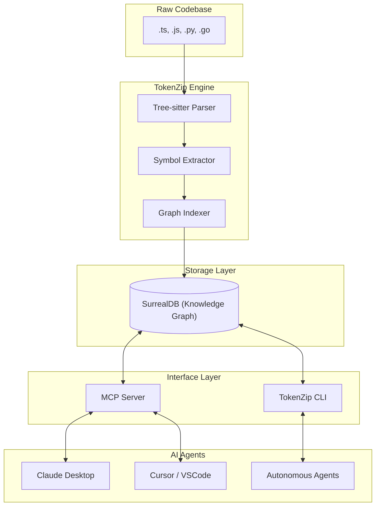

# 🏗️ TokenZip Architecture

TokenZip acts as a **Semantic Context Layer** between your AI agent and your codebase. It transforms raw text files into a structured, queryable knowledge graph.

## 🗺️ High-Level Flow

## 🧠 The Memory Mesh

TokenZip doesn't just store text; it stores **relationships**. This creates what we call the "Memory Mesh":

1.  **File Nodes**: Represent the source files.
2.  **Symbol Nodes**: Classes, Functions, Variables, Types.
3.  **Edge Relationships**:
    - `DEFINES`: A file defines a symbol.
    - `CALLS`: A function calls another function.
    - `IMPORTS`: A file imports a symbol.
    - `INHERITS`: A class extends another class.
    - `IMPLEMENTS`: A class implements an interface.

## 🗜️ Semantic Compression (Skeletonization)

When an AI agent requests a file via `smart_file_read`, the engine:
1.  Queries the graph for the file's structure.
2.  Generates a **Skeleton Projection**.
3.  Prunes implementation details (function bodies) while preserving signatures and types.
4.  Injects "Context Hints" (e.g., list of call sites or dependent files).

This reduces the token footprint by **70-90%** while maintaining 100% of the semantic meaning required for navigation and planning.

## 🛡️ Stability & Concurrency

TokenZip handles concurrent access through a **Socket-based Singleton** model:
- **Lock Management**: Ensures only one process writes to the database at a time.
- **Stale Recovery**: Automatically detects and recovers from crashed process locks.
- **Incremental Updates**: Uses content hashing to only re-parse files that have changed.
